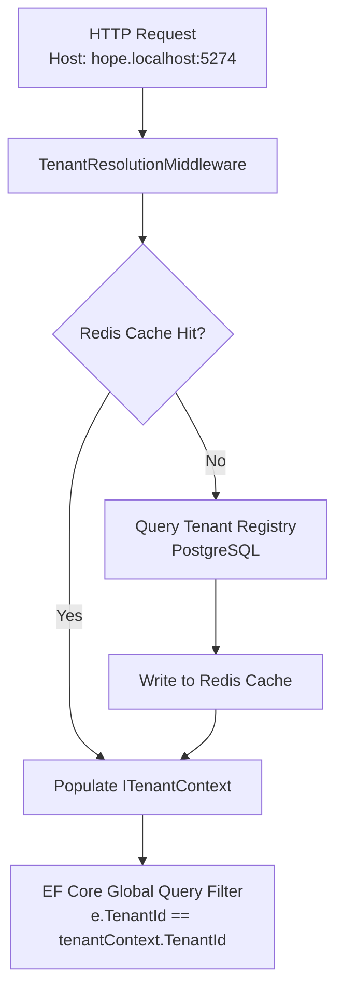
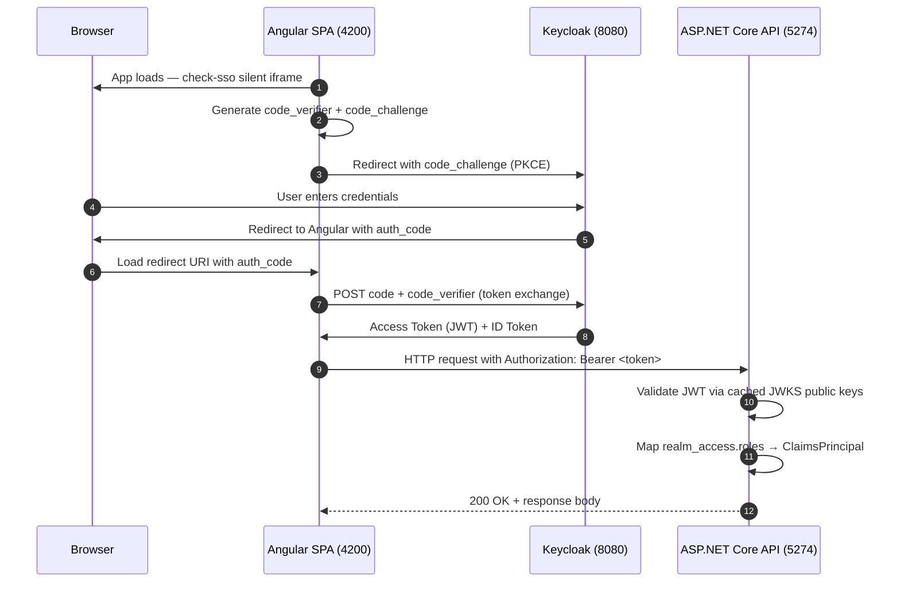
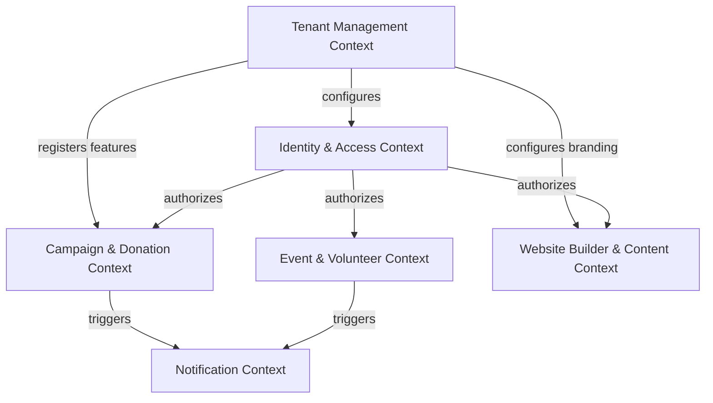
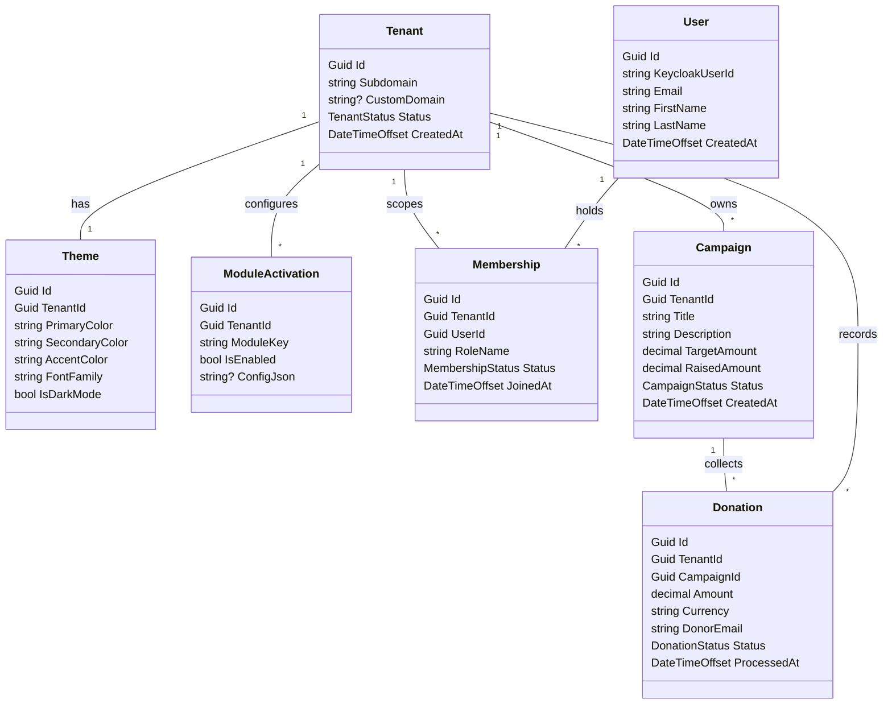
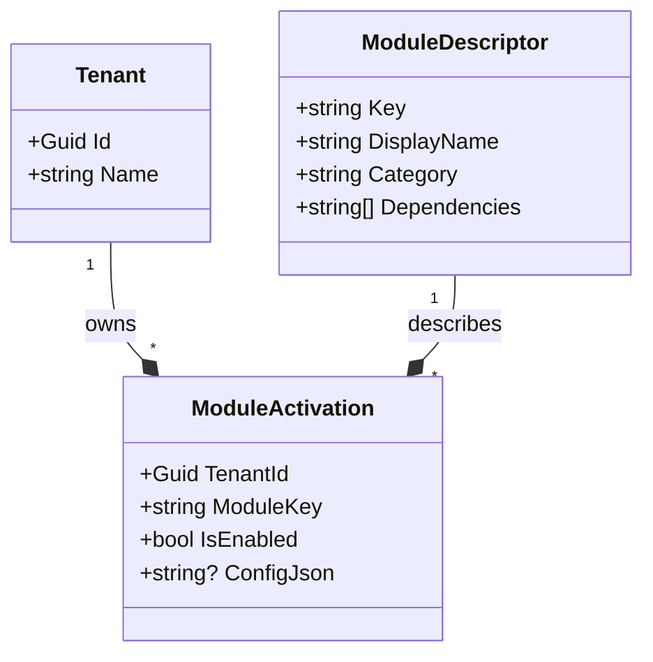

# InfiniteJourney — Platform Architecture (A-Z)

> **This is the single source of truth for platform architecture.**
> It replaces `ARCHITECTURE_AZ.md` and the old `ARCHITECTURE.md`.
> Read this before making any structural decision.

---

## Table of Contents

1. [Product Vision & Philosophy](#1-product-vision--philosophy)
2. [Three-Project Deployment Model](#2-three-project-deployment-model)
3. [Multi-Tenancy Architecture](#3-multi-tenancy-architecture)
4. [Identity & Access Management](#4-identity--access-management)
5. [Domain-Driven Design (DDD) Map](#5-domain-driven-design-ddd-map)
6. [Backend: Clean Architecture](#6-backend-clean-architecture)
7. [Frontend: Angular Architecture](#7-frontend-angular-architecture)
8. [Database Design](#8-database-design)
9. [CQRS Pattern](#9-cqrs-pattern)
10. [Modular Feature System](#10-modular-feature-system)
11. [Theme Engine](#11-theme-engine)
12. [Dynamic Website Builder](#12-dynamic-website-builder)
13. [API Strategy & NSwag](#13-api-strategy--nswag)
14. [Security](#14-security)
15. [Deployment](#15-deployment)
16. [Implementation Roadmap](#16-implementation-roadmap)

---

## 1. Product Vision & Philosophy

**InfiniteJourney** is an enterprise-grade, multi-tenant **Digital Experience Platform (DXP)** — not a charity website or a donation form. It is an **operating system for organizations**.

### Target Organization Types

| Type | Focus Areas |
|---|---|
| Charities & NGOs | Global relief, disaster response, donor relations |
| Islamic & Dawah Centers | Prayer times, courses, memberships, community events |
| Humanitarian Groups | Sponsorships, beneficiary cases, project tracking |
| Local Community Groups | Volunteer shifts, cleanups, social welfare, news |
| Educational Foundations | Courses, programs, student management |

### Core Philosophy

> *"Every module is built once. Every tenant decides to use it."*

- Every organization registers as a **Tenant**.
- All tenants share **one codebase**, **one backend**, **one deployment**.
- Tenants are completely isolated from each other — no data, no config, no branding bleeds across.
- Adding module #50 should feel as clean as adding module #1.

### What Tenants Get

1. A **white-labeled public website** with subdomain + optional custom domain support.
2. **Custom branding** — colors, logo, fonts, dark/light mode.
3. Access to a **modular feature catalog** (Campaigns, Donations, Events, Memberships, etc.).
4. Tenant-scoped **users, roles, and permissions**.
5. A **dynamic page builder** — no coding needed for tenant admins.

---

## 2. Three-Project Deployment Model

The platform is split into three **independently deployable** projects, each owning its Dockerfile, environment variables, and compose file.

```
┌──────────────────────────────────────────────────────────────────────────────┐
│                        infinite-journey-saas-app (Mono-repo)                 │
├──────────────────────┬───────────────────────────┬───────────────────────────┤
│  InfiniteJourney     │  InfiniteJourney           │  InfiniteJourney          │
│  .Keycloak           │  .Backend                  │  .Frontend                │
│                      │                            │                           │
│  • Realm + Roles     │  • REST API (.NET 9)       │  • Angular 19 SPA         │
│  • OIDC / JWT issuer │  • PostgreSQL (EF Core)    │  • nginx static hosting   │
│  • Login theme       │  • Redis cache             │  • runtime app-config     │
│  • Custom branding   │  • Multi-tenant isolation  │  • NSwag generated client │
│  Port: 8080          │  Port: 5274                │  Port: 4200               │
└──────────┬───────────┴────────────┬──────────────┴───────────────────────────┘
           │   JWT validation       │ ◄──── Bearer token ─────────────────────┘
           └───────────────────────►│
                                    │
                       PostgreSQL ◄─┘  (tenant business data — not identity)
```

### Identity & Request Flow

```
Step 1 — Login (Frontend ↔ Keycloak)

  Browser ──sign in──► Keycloak ──login page──► credentials ──► auth code
  Angular ──PKCE exchange──► Keycloak ──► access_token (JWT) + id_token

Step 2 — API Request (Frontend ↔ Backend)

  Angular ──GET /api/campaigns──►
    Host: hope.localhost:5274
    Authorization: Bearer eyJhbG...
      ──► Backend: resolve tenant (host header)
      ──► Backend: validate JWT (JWKS)
      ──► Backend: apply EF Core tenant query filter
      ──► Response 200 OK

Step 3 — JWT Validation (Backend ↔ Keycloak)

  Backend reads Keycloak:Authority once at startup.
  Fetches .well-known/openid-configuration (cached).
  Validates JWT signature using JWKS public keys — no Keycloak call per request.
  Reads roles from realm_access.roles claim.
```

### Configuration Matrix

| Setting | Keycloak | Backend | Frontend |
|---|---|---|---|
| Issuer URL | `KC_HOSTNAME` | `Keycloak__Authority` | `keycloak.url` + realm |
| SPA client | realm JSON | — | `keycloak.clientId` |
| API client | realm JSON (bearer) | validates audience | — |
| Database | Keycloak internal | PostgreSQL | — |
| Theme | `themes/infinitejourney/` | — | CSS variables via TenantContext |

### Local Orchestration

```powershell
# From repo root — all three projects together
docker compose -f docker-compose.dev.yml up -d
```

Each project remains independently runnable. See `SETUP.md` for step-by-step.

---

## 3. Multi-Tenancy Architecture

Multi-tenancy is the **highest architectural priority**. Every feature built on this platform inherits the multi-tenant foundation.

### Selected Strategy: Hybrid Tenancy (Option D)

| Strategy | Isolation | Cost | Complexity | When Used |
|---|---|---|---|---|
| A — Shared DB + TenantId | Row-level (logical) | Lowest | Low | Standard & Pro tiers |
| B — Schema-per-Tenant | Schema-level | Medium | Medium-High | Not used |
| C — DB-per-Tenant | Physical | High | High | Enterprise tier only |
| **D — Hybrid (Selected)** | **Dynamic** | **Optimal** | **Medium** | **All tiers** |

Standard tenants share a PostgreSQL database with strict row-level isolation. Enterprise/Premium tenants connect to a dedicated PostgreSQL instance resolved at runtime via a Redis-backed tenant registry.

### Tenant Resolution Pipeline



**Resolution priority order:**
1. Subdomain from `Host` header (e.g. `hope.localhost` → tenant `hope`)
2. Custom domain mapping (e.g. `hopefoundation.org` → tenant ID lookup)
3. JWT claim `tenant_id` (for API-to-API or admin flows)

### ITenantContext Interface

```csharp
public interface ITenantContext
{
    Guid TenantId { get; }
    string TenantName { get; }
    string Subdomain { get; }
    string? ConnectionString { get; }   // null = shared DB
    bool IsResolved { get; }
    bool IsFeatureEnabled(string featureKey);
}
```

### EF Core Isolation Pipeline

Every tenant-owned entity inherits `BaseTenantEntity`:

```csharp
// Global query filter — auto-applied to all reads
modelBuilder.Entity<BaseTenantEntity>()
    .HasQueryFilter(e => !_tenantContext.IsResolved || e.TenantId == _tenantContext.TenantId);
```

```csharp
// TenantSaveChangesInterceptor — auto-stamps TenantId on inserts,
// throws TenantViolationException on cross-tenant updates
if (entry.State == EntityState.Added)
    entry.Entity.TenantId = _tenantContext.TenantId;
else if (entry.Entity.TenantId != _tenantContext.TenantId)
    throw new TenantViolationException("Cross-tenant modification detected.");
```

### Tenant Provisioning Flow

When a new tenant signs up (Stripe checkout or Super Admin console):

1. Create `Tenant` record in the SaaS master database.
2. Provision Keycloak group and role mappings.
3. Execute EF Core schema migrations on the tenant's target DB.
4. Seed default `Theme`, `ModuleActivation` records, and admin `Membership`.
5. Optionally: configure custom domain DNS mapping.

---

## 4. Identity & Access Management

Authentication and authorization are built entirely on **Keycloak** using **OAuth 2.0 Authorization Code Flow with PKCE**.

### OIDC PKCE Authentication Flow



### Keycloak Realm Strategy

| Realm Type | Used For | Details |
|---|---|---|
| `InfiniteJourney` (Shared) | Standard & Pro tenants | Single realm; users carry `tenant_ids` as custom claims |
| Dedicated Realm | Enterprise tenants | Independent realm; custom SAML/OIDC federation possible |

JWT payload example for a multi-tenant user:

```json
{
  "sub": "user-uuid",
  "email": "admin@hope.org",
  "tenants": {
    "tenant-hope-uuid": ["OrganizationAdmin", "VolunteerCoordinator"],
    "tenant-relief-uuid": ["Member"]
  },
  "realm_access": { "roles": ["OrganizationAdmin"] }
}
```

### Role Hierarchy

```
Platform Level
  ├── SuperAdmin          (full SaaS platform control)
  ├── PlatformSupport     (read-only ops access)
  └── PlatformAuditor     (audit log access only)

Tenant Level
  ├── OrganizationOwner   (billing, full tenant control)
  ├── OrganizationAdmin   (users, roles, module config)
  ├── Staff               (day-to-day operations)
  ├── VolunteerCoordinator
  ├── ContentManager
  └── FinanceManager

Public Level
  ├── Member              (registered member of a tenant)
  ├── Volunteer           (registered volunteer)
  ├── Donor               (donation history tracked)
  ├── Subscriber          (newsletter only)
  └── Guest               (unauthenticated public visitor)
```

### Keycloak Client Configuration

| Setting | Value |
|---|---|
| Client ID (SPA) | `infinite-journey-web` |
| Client Type | Public (no secret) |
| Flow | Standard (Auth Code + PKCE) |
| Redirect URIs | `http://*.localhost:4200/*` |
| Web Origins | `+` (all tenant subdomains) |
| Client ID (API) | `infinite-journey-api` |
| API Client Type | Bearer-only |

### Backend JWT Validation

- **Authority**: `http://localhost:8080/realms/InfiniteJourney`
- **JWKS**: fetched once at startup, cached, no Keycloak call per request
- **Claims mapping**: `realm_access.roles` and `resource_access` → `ClaimTypes.Role`

---

## 5. Domain-Driven Design (DDD) Map

The platform is divided into **bounded contexts** that own their aggregate roots, domain events, and repositories.



### Bounded Context Definitions

#### 1 — Tenant Management Context
| | |
|---|---|
| **Purpose** | SaaS administrative plane — provisioning, billing, lifecycle |
| **Aggregate Roots** | `Tenant`, `SubscriptionPlan` |
| **Entities** | `TenantDomain`, `BillingContact`, `ModuleActivation`, `Theme` |
| **Value Objects** | `DomainName`, `Subdomain`, `TenantStatus` |
| **Domain Events** | `TenantProvisionedEvent`, `TenantSuspendedEvent`, `TenantPlanUpgradedEvent` |

#### 2 — Identity & Access Management (IAM) Context
| | |
|---|---|
| **Purpose** | Users, memberships, roles, and tenant-scoped permissions |
| **Aggregate Roots** | `User`, `Role` |
| **Entities** | `Membership`, `Permission` |
| **Value Objects** | `EmailAddress`, `UserProfile`, `MembershipStatus` |
| **Domain Events** | `UserRegisteredEvent`, `MembershipAssignedEvent`, `MembershipSuspendedEvent` |

#### 3 — Campaign & Donation Context
| | |
|---|---|
| **Purpose** | Fundraising, donation processing, and financial transparency |
| **Aggregate Roots** | `Campaign`, `Donation` |
| **Entities** | `RecurringPledge`, `DonorProfile` |
| **Value Objects** | `Money` (Amount + Currency), `TransactionReceipt` |
| **Domain Events** | `DonationReceivedEvent`, `CampaignActivatedEvent`, `CampaignGoalReachedEvent` |

#### 4 — Event & Volunteer Context
| | |
|---|---|
| **Purpose** | Community mobilization, volunteer tracking, shift management |
| **Aggregate Roots** | `Event`, `VolunteerApplication` |
| **Entities** | `Shift`, `AttendanceLog` |
| **Value Objects** | `GeographicLocation`, `DateTimeRange` |
| **Domain Events** | `VolunteerShiftAssignedEvent`, `EventPublishedEvent` |

#### 5 — Website Builder & Content Context
| | |
|---|---|
| **Purpose** | Dynamic pages, menus, blocks, SEO, and media management |
| **Aggregate Roots** | `Page`, `NavigationMenu` |
| **Entities** | `PageBlock`, `MediaFile`, `Article` |
| **Value Objects** | `Slug`, `SeoSettings`, `BlockConfig` |
| **Domain Events** | `PagePublishedEvent` |

---

## 6. Backend: Clean Architecture

The backend is structured as a Clean Architecture solution with four layers, each in its own C# project.

### Solution Structure

```
InfiniteJourney.Backend/
│
├── Domain/
│   └── InfiniteJourney.Domain/
│       ├── Aggregates/
│       │   ├── Tenant/         → Tenant.cs, Theme.cs, ModuleActivation.cs
│       │   ├── User/           → User.cs, Membership.cs
│       │   └── Campaign/       → Campaign.cs, Donation.cs, Domain Events
│       └── Common/
│           └── BaseEntity.cs   → BaseEntity, BaseTenantEntity, IDomainEvent
│
├── Application/
│   └── InfiniteJourney.Application/
│       ├── Campaigns/
│       │   ├── CampaignModels.cs       → ALL DTOs + static mapping extensions (co-located)
│       │   ├── Commands/
│       │   │   ├── Index.cs            → All command records (contracts only)
│       │   │   ├── CreateCampaignCommandHandler.cs   → Handler + Validator in one file
│       │   │   ├── UpdateCampaignCommandHandler.cs   → Handler + Validator in one file
│       │   │   ├── DeleteCampaignCommandHandler.cs
│       │   │   └── ActivateCampaignCommandHandler.cs
│       │   └── Queries/
│       │       ├── Index.cs            → All query records (contracts only)
│       │       ├── GetCampaignsQueryHandler.cs
│       │       └── GetCampaignByIdQueryHandler.cs
│       ├── Files/
│       │   └── Commands/UploadFileCommand.cs
│       └── Common/
│           ├── Abstractions/   → ICommand, IQuery, ICommandHandler, IQueryHandler
│           ├── Behaviors/      → ValidationBehavior (FluentValidation pipeline)
│           ├── Exceptions/     → AppException hierarchy (Not Found, Conflict, Forbidden, etc.)
│           ├── Extensions/     → QueryableGridExtensions (ApplySearch, ApplySort, ToPagedResultAsync)
│           ├── Interfaces/     → IApplicationDbContext, ICurrentUserService, ITenantContext, IFileStorageService
│           └── Models/         → GridQuery, PagedResult<T>, ApiErrorResponse
│
├── Infrustructure/
│   └── InfiniteJourney.Infrustructure/
│       ├── Persistence/
│       │   ├── ApplicationDbContext.cs
│       │   ├── ApplicationDbContextFactory.cs
│       │   ├── DatabaseInitializer.cs
│       │   ├── Configurations/     → EF Core entity type configurations
│       │   ├── Interceptors/       → TenantSaveChangesInterceptor
│       │   └── Migrations/
│       ├── Identity/
│       │   ├── AuthenticationDependencyInjection.cs
│       │   └── CurrentUserService.cs
│       ├── Storage/
│       │   └── LocalFileStorageService.cs
│       └── MultiTenancy/
│           ├── ITenantResolver.cs
│           ├── TenantContext.cs
│           └── TenantResolver.cs
│
├── Web/
│   └── InfiniteJourney.Web/
│       ├── Controllers/
│       │   ├── ApiControllerBase.cs    → SendAsync, SendOrNotFoundAsync, SendCreatedAsync
│       │   ├── CampaignsController.cs  → Thin; body bound directly as command
│       │   └── FilesController.cs
│       ├── Middleware/
│       │   ├── TenantResolutionMiddleware.cs   → Subdomain → TenantContext; BypassHosts for dev
│       │   └── GlobalExceptionHandler.cs       → AppException → ProblemDetails
│       ├── Filters/                    → RequireModuleAttribute
│       ├── Program.cs                  → DI wiring, JSON enum-as-string, CORS, HTTPS guard
│       ├── appsettings.json
│       ├── appsettings.Development.json → MultiTenancy:BypassHosts for localhost dev
│       └── nswag.json
│
└── AppShared/
    └── InfiniteJourney.Global.Shared/
        ├── Api/                → ApiRoutes.cs
        └── Enums/              → PlatformEnums.cs (CampaignStatus, DonationStatus, TenantStatus, etc.)
```

### Dependency Rules (Clean Architecture)

```
Domain ← Application ← Infrastructure ← Web
  ↑           ↑
  └── No external deps ──┘

Domain:          no NuGet dependencies at all
Application:     references Domain only + MediatR + FluentValidation
Infrastructure:  references Application + EF Core + Keycloak + Redis
Web:             references all; hosts DI wiring + HTTP concerns
```

### Controller Pattern

Controllers are deliberately thin — zero business logic, zero manual field mapping.  
The HTTP body is bound directly as the command record. Route params are attached via `with {}`:

```csharp
// Body → command directly. No wrapper DTO, no field spreading.
[HttpPost]
public Task<IActionResult> Create(CreateCampaignCommand command, CancellationToken ct)
    => SendCreatedAsync(command, ct, r => (nameof(GetById), new { id = r.Id }, r));

// Route id attached in one expression — no intermediate body record needed.
[HttpPut("{id:guid}")]
public Task<IActionResult> Update(Guid id, [FromBody] UpdateCampaignCommand command, CancellationToken ct)
    => SendAsync(command with { CampaignId = id }, ct);
```

---

## 7. Frontend: Angular Architecture

The frontend is built with **Angular 19 Standalone Components** and **Angular Signals** for reactive state.

### Project Structure

```
InfiniteJourney.Frontend/Web/InfiniteJourney.Web/
└── src/
    ├── main.ts
    ├── styles.scss
    └── app/
        ├── app.ts              → Root standalone component
        ├── app.routes.ts       → Lazy-loaded feature routes
        ├── app.config.ts       → ApplicationConfig (providers, interceptors)
        │
        ├── core/
        │   ├── config/         → App-config.json reader, environment resolution
        │   ├── interceptors/   → authInterceptor (JWT injection), errorInterceptor
        │   ├── models/         → Core TypeScript interfaces (TenantContext, UserProfile)
        │   └── services/       → KeycloakService, TenantContextService
        │
        ├── features/
        │   └── campaigns/      → CampaignListComponent, CampaignDetailComponent
        │       (future: donations/, events/, memberships/, admin/)
        │
        └── generated/
            └── infinite-journey-apis.ts   → NSwag auto-generated typed API clients
```

### Key Design Decisions

**No manually written HTTP services.** Angular components import generated clients directly:

```typescript
// Generated by NSwag — never written by hand
import { CampaignsClient, CreateCampaignCommand } from '../../generated/infinite-journey-apis';

constructor(private campaigns: CampaignsClient) {}

load() {
  this.campaigns.getAll().subscribe(data => this.items.set(data));
}
```

**Dynamic tenant base URL** — resolved at runtime from `app-config.json`, not compiled:

```typescript
// TenantContextService reads host to resolve the correct API base
const subdomain = window.location.hostname.split('.')[0]; // e.g. "hope"
const apiBase   = `http://${subdomain}.localhost:5274`;
```

**Theme injection on bootstrap** — CSS variables set from `TenantContext`:

```typescript
document.documentElement.style.setProperty('--primary-color', theme.primaryColor);
document.documentElement.style.setProperty('--secondary-color', theme.secondaryColor);
document.documentElement.style.setProperty('--font-family', theme.fontFamily);
```

**Responsive design with Tailwind CSS** — Mobile-first approach with utility classes:

```typescript
// Tailwind configured to use CSS variables for theming
colors: {
  primary:   'var(--primary)',
  secondary: 'var(--secondary)',
  accent:    'var(--accent)',
}
```

**Collapsible sidebar navigation** — Professional navigation with responsive behavior:

```typescript
// Desktop: Always visible, sticky positioning
// Mobile/Tablet: Collapsible with hamburger menu
protected readonly sidebarCollapsed = signal(false);
protected toggleSidebar(): void {
  this.sidebarCollapsed.update(collapsed => !collapsed);
}
```

**Rich text editing with Quill.js** — Professional content creation:

```typescript
// Quill editor integrated for campaign descriptions
protected readonly editorModules = {
  toolbar: [
    ['bold', 'italic', 'underline', 'strike'],
    ['blockquote', 'code-block'],
    [{ 'header': 1 }, { 'header': 2 }],
    [{ 'list': 'ordered'}, { 'list': 'bullet' }],
    ['link', 'clean']
  ]
};
```

**Font Awesome icons** — Professional iconography:

```typescript
// Font Awesome icons for navigation and actions
<i class="fas fa-bullhorn"></i>    // Campaigns
<i class="fas fa-cog"></i>         // Settings
<i class="fas fa-palette"></i>     // Theme
<i class="fas fa-ellipsis-v"></i>  // More actions
```

**Responsive table with action menu** — Mobile-friendly data tables:

```typescript
// Desktop: Full action buttons
// Mobile/Tablet: Three-dot dropdown menu
<nz-dropdown nzTrigger="click" nzPlacement="bottomRight">
  <button nz-button nzType="text">
    <i class="fas fa-ellipsis-v"></i>
  </button>
  <ul nz-menu>
    <li nz-menu-item><i class="fas fa-edit"></i> Edit</li>
    <li nz-menu-item nzDanger><i class="fas fa-trash"></i> Delete</li>
  </ul>
</nz-dropdown>
```

**Debounced search** — Performance optimization for search inputs:

```typescript
// 300ms debounce prevents excessive API calls
private readonly searchSubject = new Subject<string>();
this.searchSubject.pipe(
  debounceTime(300),
  distinctUntilChanged()
).subscribe(searchTerm => {
  this.search.set(searchTerm);
  this.loadData();
});
```

**Silent SSO** — `keycloak-js` checks existing sessions without interrupting the user:

```html
<!-- public/assets/silent-check-sso.html -->
<script> parent.postMessage(location.href, location.origin); </script>
```

### Keycloak Theme Strategy

| Approach | Status |
|---|---|
| Extend base theme (CSS only) | **Active** — `themes/infinitejourney/` overrides colors, logo, typography |
| Keycloakify (React login UI) | Planned — Phase 2 option for fully custom login experience |
| Theme fork | Not used — hard to maintain across Keycloak upgrades |

```
themes/infinitejourney/login/theme.properties
  parent=keycloak
  import=common/keycloak
```

---

## 8. Database Design

### Entity Relationship Overview



### Core Table DDL

```sql
CREATE TABLE Tenants (
    Id           UUID PRIMARY KEY,
    Subdomain    VARCHAR(100) UNIQUE NOT NULL,
    CustomDomain VARCHAR(255) UNIQUE,
    Status       VARCHAR(25) NOT NULL,
    CreatedAt    TIMESTAMPTZ NOT NULL
);

CREATE TABLE Users (
    Id             UUID PRIMARY KEY,
    KeycloakUserId VARCHAR(255) UNIQUE NOT NULL,
    Email          VARCHAR(255) NOT NULL,
    FirstName      VARCHAR(100),
    LastName       VARCHAR(100),
    CreatedAt      TIMESTAMPTZ NOT NULL
);

CREATE TABLE Memberships (
    Id       UUID PRIMARY KEY,
    TenantId UUID NOT NULL,
    UserId   UUID NOT NULL REFERENCES Users(Id),
    RoleName VARCHAR(50) NOT NULL,
    Status   VARCHAR(20) NOT NULL,
    JoinedAt TIMESTAMPTZ NOT NULL
);
CREATE UNIQUE INDEX idx_membership_tenant_user ON Memberships(TenantId, UserId);

CREATE TABLE Campaigns (
    Id           UUID PRIMARY KEY,
    TenantId     UUID NOT NULL REFERENCES Tenants(Id),
    Title        VARCHAR(255) NOT NULL,
    Description  TEXT,
    TargetAmount DECIMAL(18,2) NOT NULL,
    RaisedAmount DECIMAL(18,2) DEFAULT 0.00,
    Status       VARCHAR(25) NOT NULL,
    CreatedAt    TIMESTAMPTZ NOT NULL
);
CREATE INDEX idx_campaigns_tenant ON Campaigns(TenantId);

CREATE TABLE Donations (
    Id          UUID PRIMARY KEY,
    TenantId    UUID NOT NULL REFERENCES Tenants(Id),
    CampaignId  UUID NOT NULL REFERENCES Campaigns(Id),
    Amount      DECIMAL(18,2) NOT NULL,
    Currency    VARCHAR(10) NOT NULL DEFAULT 'GBP',
    DonorEmail  VARCHAR(255) NOT NULL,
    Status      VARCHAR(20) NOT NULL,
    ProcessedAt TIMESTAMPTZ NOT NULL
);
CREATE INDEX idx_donations_tenant_campaign ON Donations(TenantId, CampaignId);
```

### Indexing Strategy

- Every `TenantId` column has an index — this is the most frequent filter predicate.
- Composite indexes on `(TenantId, <domain_key>)` for high-frequency queries (e.g. `(TenantId, CampaignId)` on Donations).
- Unique constraint on `(TenantId, UserId)` in Memberships prevents duplicate memberships.

---

## 9. CQRS Pattern

We implement strict **Command-Query Responsibility Segregation** using **MediatR**. Write and read paths are completely separate.

### Feature Folder Structure

```
Application/
└── Campaigns/
    ├── Commands/
    │   ├── CreateCampaignCommand.cs          → ICommand<CampaignDetailDto>
    │   ├── CreateCampaignCommandHandler.cs   → ICommandHandler<...>
    │   ├── CreateCampaignCommandValidator.cs → AbstractValidator<...>
    │   └── ActivateCampaignCommand.cs
    ├── Queries/
    │   ├── GetCampaignsQuery.cs              → IQuery<List<CampaignListItemDto>>
    │   ├── GetCampaignsQueryHandler.cs
    │   ├── GetCampaignByIdQuery.cs
    │   └── GetCampaignByIdQueryHandler.cs
    ├── Dtos/
    │   └── CampaignDtos.cs                   → CampaignDetailDto, CampaignListItemDto
    └── Mappings/
        └── CampaignMappings.cs               → Mapster / AutoMapper profiles
```

### CQRS Abstractions

```csharp
// Domain request markers — in InfiniteJourney.Application/Common/Abstractions
public interface ICommand<TResult> : IRequest<TResult> { }
public interface IQuery<TResult>   : IRequest<TResult> { }

public interface ICommandHandler<TCommand, TResult>
    : IRequestHandler<TCommand, TResult> where TCommand : ICommand<TResult> { }

public interface IQueryHandler<TQuery, TResult>
    : IRequestHandler<TQuery, TResult> where TQuery : IQuery<TResult> { }
```

### MediatR Pipeline Behaviors

Behaviors registered in order:

1. **ValidationBehavior** — runs FluentValidation before handler executes; returns 400 on failure
2. *(Future)* **LoggingBehavior** — structured Serilog tracing per request
3. *(Future)* **CachingBehavior** — Redis query result caching for `IQuery<>` handlers
4. *(Future)* **TransactionBehavior** — wraps `ICommand<>` handlers in a DB transaction

---

## 10. Modular Feature System

Every functional capability of the platform is a **module**. Tenants opt in — no module is forced on any organization.

### Module Catalog

| Module Key | Category | Status |
|---|---|---|
| `Campaigns` | Fundraising | ✅ Phase 1 (Built) |
| `Donations` | Fundraising | 🔜 Phase 1 Next |
| `Memberships` | Community | 🔜 Phase 2 |
| `Events` | Community | 🔜 Phase 2 |
| `Volunteers` | Community | 🔜 Phase 2 |
| `Courses` | Education | 🔜 Phase 3 |
| `Sponsorships` | Fundraising | 🔜 Phase 3 |
| `BeneficiaryCases` | Humanitarian | 🔜 Phase 3 |
| `Blog` / `News` | Content | 🔜 Phase 2 |
| `NewsletterSubscriber` | Engagement | 🔜 Phase 3 |
| `WebsiteBuilder` | Platform | 🔜 Phase 2 |
| `Analytics` / `Reports` | Platform | 🔜 Future |
| `MediaLibrary` | Platform | 🔜 Phase 2 |

### Module Activation Model



### Feature Toggle Behavior

- **Disabled module**: API endpoint returns `403 Feature Not Enabled` via ASP.NET Core endpoint filter.
- **UI hidden**: Angular route guard checks `TenantContextService.isFeatureEnabled('Campaigns')` before activating the route.
- **Data preserved**: Disabling never deletes data. Re-enabling restores prior state instantly.

```csharp
// ASP.NET Core endpoint filter — registered per-controller or per-route
public class RequireFeatureFilter(string featureKey, ITenantContext tenant) : IEndpointFilter
{
    public async ValueTask<object?> InvokeAsync(EndpointFilterInvocationContext ctx, EndpointFilterDelegate next)
    {
        if (!tenant.IsFeatureEnabled(featureKey))
            return Results.Forbid();
        return await next(ctx);
    }
}
```

---

## 11. Theme Engine

Every tenant has a fully isolated visual identity applied at runtime — no rebuild or redeploy required.

### Theme Configuration (Stored in DB)

```json
{
  "PrimaryColor":   "#1E3A8A",
  "SecondaryColor": "#10B981",
  "AccentColor":    "#F59E0B",
  "FontFamily":     "Inter, sans-serif",
  "IsDarkMode":     false,
  "LogoUrl":        "/media/hope-logo.svg",
  "FaviconUrl":     "/media/hope-favicon.ico"
}
```

### Angular Runtime Injection

On app bootstrap, `TenantContextService` fetches the tenant theme and injects CSS variables:

```typescript
document.documentElement.style.setProperty('--primary-color',   theme.primaryColor);
document.documentElement.style.setProperty('--secondary-color', theme.secondaryColor);
document.documentElement.style.setProperty('--accent-color',    theme.accentColor);
document.documentElement.style.setProperty('--font-family',     theme.fontFamily);
```

Tailwind classes use these variables via `tailwind.config.js`:

```js
colors: {
  primary:   'var(--primary-color)',
  secondary: 'var(--secondary-color)',
  accent:    'var(--accent-color)',
}
```

### WCAG Contrast Auto-Adjustment

Text overlay colors are computed at runtime to maintain WCAG AA compliance. If the primary background is dark, text flips to `#FFFFFF`; if light, text uses `#111827`.

---

## 12. Dynamic Website Builder

Tenant portals are rendered using a **JSON-driven block layout** stored in the database. Tenant admins configure pages without writing code.

### Page Entity Model

```json
{
  "Id": "page-uuid",
  "TenantId": "tenant-uuid",
  "Slug": "about-us",
  "Title": "About Our Journey",
  "SeoSettings": {
    "MetaTitle":        "About — Hope Foundation",
    "MetaDescription":  "Empowering communities with transparency.",
    "OpenGraphImage":   "/media/og-about.jpg"
  },
  "Layout": [
    { "Type": "HeroSection",     "Params": { "Title": "Hello!", "BgUrl": "/media/bg.jpg" } },
    { "Type": "StatisticsBanner","Params": { "CampaignId": "uuid" } },
    { "Type": "DonationWidget",  "Params": { "CampaignId": "uuid", "ShowProgress": true } },
    { "Type": "ArticleGrid",     "Params": { "Count": 3, "Category": "news" } }
  ]
}
```

### Available Block Types (Phase 2)

| Block Type | Description |
|---|---|
| `HeroSection` | Full-width hero with title, subtitle, CTA button |
| `DonationWidget` | Live campaign progress bar + donate button |
| `StatisticsBanner` | Impact numbers (donors, raised amount, projects) |
| `ArticleGrid` | Latest news / blog cards |
| `EventList` | Upcoming events grid |
| `TeamMembers` | Staff showcase |
| `ContactForm` | Tenant contact form with validation |
| `CustomHtml` | Raw HTML block for advanced tenants |

---

## 13. API Strategy & NSwag

### REST API Conventions

- **Versioning**: URL-based (`/api/v1/campaigns`) — to be introduced before first public release.
- **Route constants**: All route strings live in `ApiRoutes.cs` inside `InfiniteJourney.Global.Shared`, shared across backend and (via NSwag) frontend.
- **Error responses**: Standardized `ProblemDetails` (RFC 7807) format for all error states.
- **Pagination**: Cursor-based for large collections (Phase 2); offset for MVP.

### NSwag Auto-Generated Client

The backend hosts an OpenAPI spec via NSwag (configured in `nswag.json`). The Angular project runs client generation as a script:

```powershell
# Frontend must have backend running at localhost:5274
cd InfiniteJourney.Frontend/Web/InfiniteJourney.Web
npm run generate-api
```

This regenerates `src/app/generated/infinite-journey-apis.ts` — a fully typed TypeScript client. **No Angular developer ever writes a manual HTTP request.**

### OpenAPI Integration Points

| Concern | Solution |
|---|---|
| API documentation | Swagger UI at `/swagger` (dev only) |
| Client generation | NSwag → `infinite-journey-apis.ts` |
| Type safety | All request/response DTOs are auto-typed in TypeScript |
| Versioning | NSwag config updated per version bump |

---

## 14. Security

### Tenant Isolation Guarantees

| Layer | Mechanism |
|---|---|
| Read isolation | EF Core Global Query Filters (`TenantId == tenantContext.TenantId`) |
| Write isolation | `TenantSaveChangesInterceptor` — auto-stamps TenantId, throws on cross-tenant update |
| API isolation | `TenantResolutionMiddleware` — resolves and locks TenantContext per request scope |
| Auth isolation | JWT claims carry `tenant_ids`; backend validates membership before processing |

### OWASP Safeguards

| Threat | Mitigation |
|---|---|
| Cross-tenant data leak | EF Core filters + save interceptor |
| Broken authentication | Keycloak PKCE + short-lived JWT + refresh token rotation |
| CORS abuse | Strict `Cors:AllowedOrigins` per environment |
| Injection attacks | EF Core parameterized queries only — no raw SQL |
| CSRF | Anti-CSRF tokens on state-mutating POST/PUT endpoints |
| Rate limiting | IP + Tenant scoped rate limiting via ASP.NET Core middleware |
| Security headers | CSP, X-Frame-Options, X-Content-Type-Options enforced |
| Secrets management | `.env` files + Docker secrets; never committed to git |

### Authorization Policy Approach

```csharp
// Policies registered at startup
options.AddPolicy("RequireTenantMember",
    policy => policy.RequireClaim("tenant_id", tenantId.ToString()));

options.AddPolicy("RequireOrganizationAdmin",
    policy => policy.RequireRole("OrganizationAdmin"));
```

---

## 15. Deployment

### Environment Matrix

| Component | Dev | Staging | Production |
|---|---|---|---|
| Keycloak | Docker `start-dev` | Dedicated VM / K8s pod | HA Keycloak cluster + external DB |
| Backend API | `dotnet run` or Docker | Container + managed PostgreSQL (Azure DB / AWS RDS) | K8s deployment + RDS |
| Frontend | `npm start` or Docker | CDN + nginx container | CDN + WAF (CloudFront / Azure CDN) |
| PostgreSQL | Docker compose | Managed cloud DB | Managed cloud DB with replicas |
| Redis | Docker compose | Managed Redis (ElastiCache / Azure Cache) | Managed Redis cluster |

### Docker Compose Architecture (Dev)

```yaml
# docker-compose.dev.yml — root orchestrator
include:
  - path: InfiniteJourney.Keycloak/docker-compose.yml
  - path: InfiniteJourney.Backend/docker-compose.yml
  - path: InfiniteJourney.Frontend/docker-compose.yml

networks:
  default:
    name: infinitejourney-dev
```

**Backend `docker-compose.yml` services:**

```yaml
postgres:
  image: postgres:15-alpine
  environment:
    POSTGRES_DB: infinite_journey_saas
    POSTGRES_PASSWORD: postgresql2002
  ports: ["5432:5432"]

redis:
  image: redis:7-alpine
  ports: ["6379:6379"]

backend-api:
  build:
    context: .
    dockerfile: Web/InfiniteJourney.Web/Dockerfile
  ports: ["5274:8080"]
  depends_on: [postgres, redis, keycloak]
```

### Production Deployment Pattern

Each project publishes its own Docker image. URLs connect via environment variables only — zero code changes between environments.

```powershell
# Build and push images independently
docker build -t infinitejourney-keycloak  ./InfiniteJourney.Keycloak
docker build -t infinitejourney-backend   ./InfiniteJourney.Backend
docker build -t infinitejourney-frontend  ./InfiniteJourney.Frontend
```

### Kubernetes Readiness

The architecture is designed for eventual K8s migration:
- Stateless backend API (session state in Redis, not in-process)
- External PostgreSQL and Redis — no local state
- Health check endpoints: `/health` (liveness) and `/health/ready` (readiness)
- Environment-variable-only configuration (12-factor app compliant)

---

## 16. Implementation Roadmap

### Phase 1 — Foundation & Reference Module (Current)

| Task | Status |
|---|---|
| Multi-tenancy middleware + EF Core isolation | ✅ Done |
| Keycloak JWT authentication + claims mapping | ✅ Done |
| Campaign domain entities + CQRS handlers | ✅ Done |
| NSwag OpenAPI + Angular generated client | ✅ Done |
| Angular Campaigns UI (list + detail) | ✅ Done |
| Three-project Docker deployment structure | ✅ Done |
| **Donation module (domain + API + UI)** | 🔜 Next |
| **User / Membership sync from Keycloak** | 🔜 Next |
| **Module feature toggle enforcement** | 🔜 Next |

### Phase 2 — Community Modules

- Memberships (registration, roles, lifecycle)
- Events (creation, RSVP, shift management)
- Volunteers (applications, tracking, hours)
- Blog / News (articles, categories, SEO)
- Website Builder (dynamic page editor)
- Media Library (file uploads, CDN integration)

### Phase 3 — Advanced Platform

- Courses & educational content
- Sponsorships & beneficiary case management
- Newsletter & subscriber management
- Production Keycloak hardening (dedicated realms, SAML federation)
- Analytics dashboard and reporting
- Stripe Connect for tenant-scoped payment flows

### Phase 4 — Scale & Enterprise

- Multi-region deployment
- Dedicated database provisioning for Enterprise tenants
- Platform audit logs and compliance reporting
- Mobile app API layer
- Microservice extraction candidates (Notification, Payment, Analytics)

---

## Appendix: Open Architectural Decisions

| Decision | Options | Recommended | Notes |
|---|---|---|---|
| Payment gateway | Stripe Connect (platform fees) vs. tenant-own keys | **Stripe Connect** | Enables platform revenue share |
| Keycloak realm for enterprise | Single shared vs. realm-per-tenant | **Realm-per-tenant for Enterprise** | Allows custom SSO (SAML/OIDC) |
| API versioning | URL (`/v1`) vs. header (`api-version`) | **URL-based** | Simpler for NSwag generation |
| Background jobs | Hangfire vs. Quartz.NET vs. Azure Service Bus | **Hangfire** (Phase 2) | Simple, PostgreSQL-backed, tenant-aware |
| Media storage | Local disk vs. Azure Blob vs. S3 | **Azure Blob / S3** (Phase 2) | Tenant-scoped containers |

---

*Update this file when architectural decisions change — not for task tracking. See `implementation_plan.md` for execution status.*
