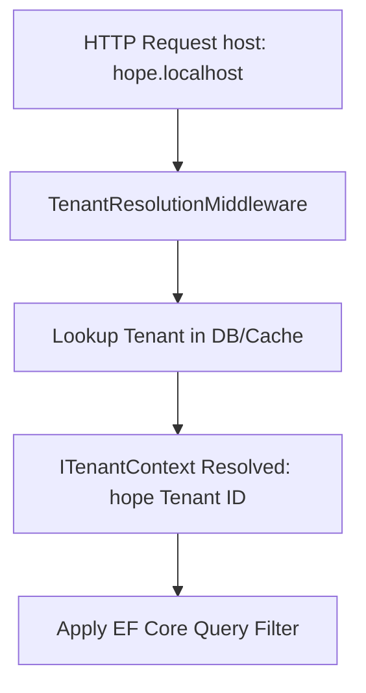
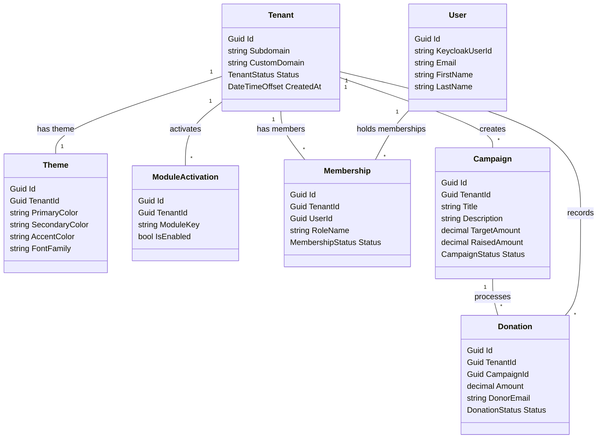

# InfiniteJourney - Platform Architecture & Design Guide (A-Z)

This document provides a comprehensive overview of the architectural design, database schemas, and system flows of the **InfiniteJourney** multi-tenant digital experience platform.

---

## 1. Multi-Tenancy & Data Isolation

InfiniteJourney is built from the ground up as a SaaS platform where multiple organizations (Tenants) share a single running instance of the application and database (logical multi-tenancy) while maintaining physical data isolation.

### Tenant Resolution
1. **Subdomain Detection**: The incoming HTTP host header (e.g., `hope.localhost:4200` or `relief.localhost:4200`) is parsed by the [TenantResolutionMiddleware](file:///d:/infinite-journey-saas-app/InfiniteJourney.Backend/Web/InfiniteJourney.Web/Middleware/TenantResolutionMiddleware.cs) on the backend.
2. **Context Resolution**: The middleware queries the tenant registry to resolve the Tenant ID, branding details, and enabled modules, populating a scoped [ITenantContext](file:///d:/infinite-journey-saas-app/InfiniteJourney.Backend/Application/InfiniteJourney.Application/Common/Interfaces/ITenantContext.cs) instance for the lifetime of the request.



### EF Core Isolation Pipeline
- **Global Query Filters**: Every tenant-owned database entity inherits from `BaseTenantEntity` which includes a `TenantId` property. EF Core automatically registers a global query filter:
  ```csharp
  modelBuilder.Entity<BaseTenantEntity>()
      .HasQueryFilter(e => !_tenantContext.IsResolved || e.TenantId == _tenantContext.TenantId);
  ```
- **Tenant Save Interceptor**: To prevent cross-tenant data corruption or write leakages, a custom [TenantSaveChangesInterceptor](file:///d:/infinite-journey-saas-app/InfiniteJourney.Backend/Infrustructure/InfiniteJourney.Infrustructure/Persistence/Interceptors/TenantSaveChangesInterceptor.cs) intercepts EF database writes. It automatically stamps the active `TenantId` on any newly inserted entities and throws a `TenantViolationException` if a request attempts to modify an entity belonging to a different tenant.

---

## 2. CQRS Pattern & Controller Architecture

We implement a strict command-query responsibility segregation (CQRS) architecture utilizing MediatR to completely isolate write operations (Commands) from read operations (Queries).

### Backend Folder Structure
The Application layer is grouped into feature-specific folders, containing sub-folders for DTOs, Commands, and Queries:
```
InfiniteJourney.Application/
└── Campaigns/
    ├── Commands/
    │   ├── ActivateCampaignCommand.cs
    │   └── CreateCampaignCommand.cs
    ├── Queries/
    │   ├── GetCampaignByIdQuery.cs
    │   └── GetCampaignsQuery.cs
    └── Dtos/
        ├── CampaignDetailDto.cs
        └── CampaignListItemDto.cs
```

### Clean Controllers
Controllers contain **no business logic, mapping, or manual model binding**. They are extremely lean and simply forward the incoming DTO request to MediatR:
```csharp
[HttpGet(ApiRoutes.Campaigns.ById)]
public Task<IActionResult> GetById([AsParameters] GetCampaignByIdRoute route, CancellationToken cancellationToken)
    => SendOrNotFoundAsync(new GetCampaignByIdQuery(route.Id), cancellationToken);
```

---

## 3. Database Schema & Entity Relationships

The schema maps multi-tenancy configurations, membership mappings, event listings, and donations.



---

## 4. Frontend Angular Architecture

The frontend is built using **Angular 19 Standalone Components**, utilizing **Angular Signals** for reactive state tracking.

### Code Organization
```
src/app/
├── core/             # Auth service, HTTP Interceptors, configurations
├── features/         # Features like campaigns, donation pages
├── generated/        # NSwag auto-generated TypeScript API client
└── public/           # Static config files, silent SSO check HTML
```

### Automatic API Client Integration
We run NSwag as a post-build target on the backend to automatically build the type-safe client file `infinite-journey-apis.ts`.
- **Zero Manual APIs**: Angular components never define HTTP request paths or manual endpoints. They import `CampaignsClient` directly.
- **Dynamic API Base Url**: Registered in `app.config.ts` using `TenantContextService` to dynamically resolve paths based on localhost subdomains.
