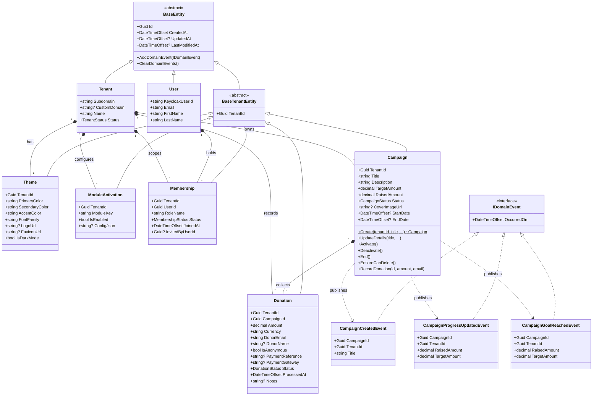
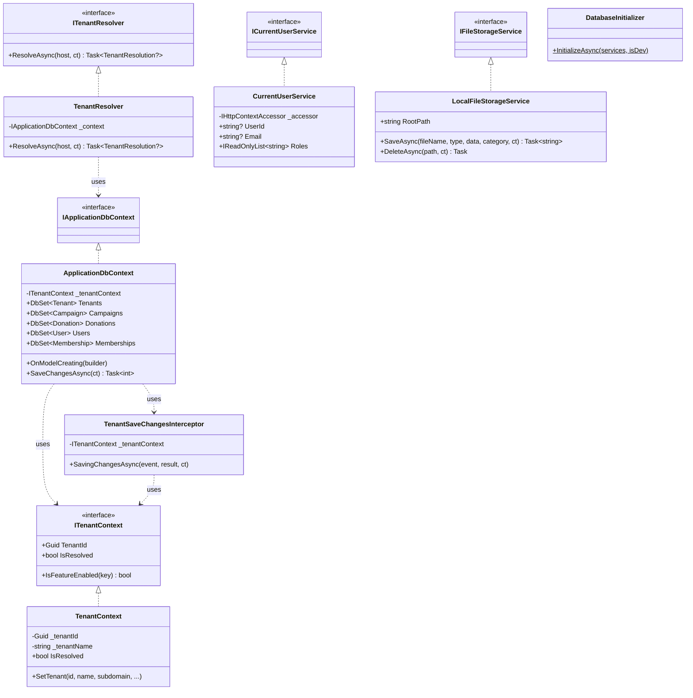
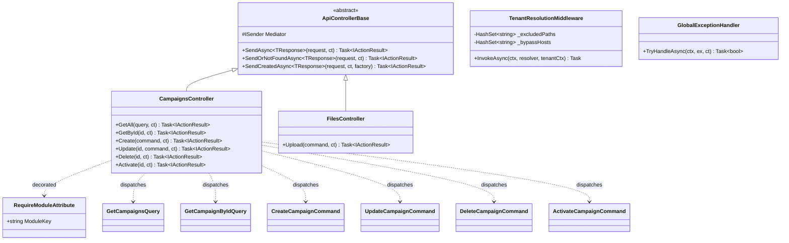
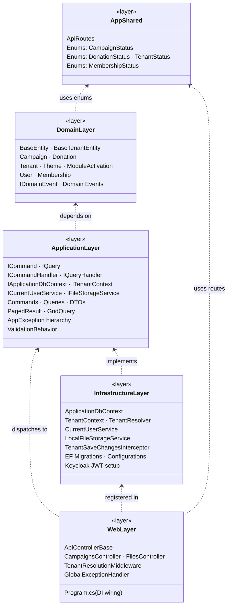
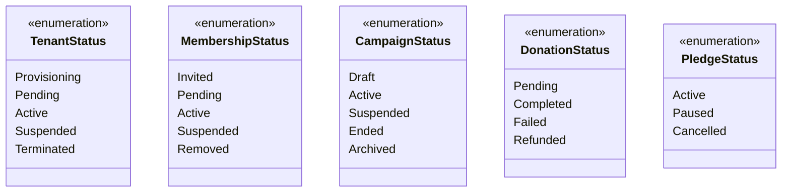

# InfiniteJourney — UML Class Diagram (Phase 1 Current State)

> **How to use:** Copy any section below into [draw.io](https://app.diagrams.net/), choose  
> `Extras → Edit Diagram` and paste the XML — or use the Mermaid blocks directly.  
> Each layer is a separate diagram to keep them readable.

---

## 1. Domain Layer — Full Class Diagram

---

## 2. Application Layer — CQRS + Interfaces

```mermaid
classDiagram

    %% ─── CQRS Abstractions ────────────────────────────────────────
    class ICommand~TResponse~ {
        <<interface>>
    }
    class ICommandHandler~TCommand_TResponse~ {
        <<interface>>
        +Handle(command, ct) Task~TResponse~
    }
    class IQuery~TResponse~ {
        <<interface>>
    }
    class IQueryHandler~TQuery_TResponse~ {
        <<interface>>
        +Handle(query, ct) Task~TResponse~
    }

    %% ─── Application Interfaces ───────────────────────────────────
    class IApplicationDbContext {
        <<interface>>
        +DbSet~Tenant~ Tenants
        +DbSet~Theme~ Themes
        +DbSet~ModuleActivation~ ModuleActivations
        +DbSet~User~ Users
        +DbSet~Membership~ Memberships
        +DbSet~Campaign~ Campaigns
        +DbSet~Donation~ Donations
        +SaveChangesAsync(ct) Task~int~
    }

    class ITenantContext {
        <<interface>>
        +Guid TenantId
        +string TenantName
        +string Subdomain
        +string? ConnectionString
        +bool IsResolved
        +IsFeatureEnabled(key) bool
    }

    class ICurrentUserService {
        <<interface>>
        +string? UserId
        +string? Email
        +IReadOnlyList~string~ Roles
    }

    class IFileStorageService {
        <<interface>>
        +SaveAsync(fileName, contentType, data, category, ct) Task~string~
        +DeleteAsync(path, ct) Task
    }

    %% ─── Campaign Commands ────────────────────────────────────────
    class CreateCampaignCommand {
        +string Title
        +string Description
        +decimal TargetAmount
        +string? CoverImageUrl
        +DateTimeOffset? StartDate
        +DateTimeOffset? EndDate
    }
    class CreateCampaignCommandHandler {
        -IApplicationDbContext _context
        -ITenantContext _tenantContext
        +Handle(cmd, ct) Task~CreateCampaignResultDto~
    }
    class CreateCampaignCommandValidator {
        +Rules: Title NotEmpty MaxLength(255)
        +Rules: TargetAmount GreaterThan(0)
        +Rules: EndDate gt StartDate
    }

    class UpdateCampaignCommand {
        +Guid CampaignId
        +string Title
        +string Description
        +decimal TargetAmount
        +string? CoverImageUrl
        +DateTimeOffset? StartDate
        +DateTimeOffset? EndDate
    }
    class UpdateCampaignCommandHandler {
        -IApplicationDbContext _context
        +Handle(cmd, ct) Task~CampaignDetailDto~
    }

    class DeleteCampaignCommand {
        +Guid CampaignId
    }
    class DeleteCampaignCommandHandler {
        -IApplicationDbContext _context
        -IFileStorageService _fileStorage
        +Handle(cmd, ct) Task~bool~
    }

    class ActivateCampaignCommand {
        +Guid CampaignId
    }
    class ActivateCampaignCommandHandler {
        -IApplicationDbContext _context
        +Handle(cmd, ct) Task~CampaignDetailDto~
    }

    %% ─── Campaign Queries ─────────────────────────────────────────
    class GetCampaignsQuery {
        +CampaignStatus? Status
        +int PageIndex
        +int PageSize
        +string? Search
        +string? SortBy
        +string? SortDirection
    }
    class GetCampaignsQueryHandler {
        -IApplicationDbContext _context
        +Handle(qry, ct) Task~PagedResult~CampaignListItemDto~~
    }

    class GetCampaignByIdQuery {
        +Guid CampaignId
    }
    class GetCampaignByIdQueryHandler {
        -IApplicationDbContext _context
        +Handle(qry, ct) Task~CampaignDetailDto?~
    }

    %% ─── Pipeline Behaviors ───────────────────────────────────────
    class ValidationBehavior~TRequest_TResponse~ {
        -IEnumerable~IValidator~ _validators
        +Handle(req, next, ct) Task~TResponse~
    }

    %% ─── Exceptions ───────────────────────────────────────────────
    class AppException {
        <<abstract>>
        +int StatusCode
        +string ErrorCode
    }
    class NotFoundException { StatusCode=404 }
    class BusinessRuleException { StatusCode=409 }
    class ConflictException { StatusCode=409 }
    class ForbiddenAppException { StatusCode=403 }
    class TenantViolationException { StatusCode=403 }

    AppException <|-- NotFoundException
    AppException <|-- BusinessRuleException
    AppException <|-- ConflictException
    AppException <|-- ForbiddenAppException
    AppException <|-- TenantViolationException

    %% ─── DTOs ─────────────────────────────────────────────────────
    class CampaignListItemDto {
        +Guid Id
        +string Title
        +string Description
        +decimal TargetAmount
        +decimal RaisedAmount
        +CampaignStatus Status
        +string? CoverImageUrl
        +DateTimeOffset? StartDate
        +DateTimeOffset? EndDate
    }
    class CampaignDetailDto {
        +Guid Id
        +string Title
        +string Description
        +decimal TargetAmount
        +decimal RaisedAmount
        +CampaignStatus Status
        +string? CoverImageUrl
        +DateTimeOffset? StartDate
        +DateTimeOffset? EndDate
        +DateTimeOffset CreatedAt
        +decimal ProgressPercent
    }
    class CreateCampaignResultDto {
        +Guid Id
    }

    %% ─── Grid / Pagination ────────────────────────────────────────
    class GridQuery {
        +int PageIndex
        +int PageSize
        +string? Search
        +string? SortBy
        +string? SortDirection
        +bool IsDescending
    }
    class PagedResult~T~ {
        +IReadOnlyList~T~ Data
        +int PageIndex
        +int PageSize
        +int Total
        +int TotalPages
        +Create(data, total, grid)$
        +Map~TDto~(selector) PagedResult~TDto~
    }

    ICommand~TResponse~ <|.. CreateCampaignCommand
    ICommand~TResponse~ <|.. UpdateCampaignCommand
    ICommand~TResponse~ <|.. DeleteCampaignCommand
    ICommand~TResponse~ <|.. ActivateCampaignCommand
    IQuery~TResponse~ <|.. GetCampaignsQuery
    IQuery~TResponse~ <|.. GetCampaignByIdQuery
    GetCampaignsQuery --|> GridQuery

    ICommandHandler~TCommand_TResponse~ <|.. CreateCampaignCommandHandler
    ICommandHandler~TCommand_TResponse~ <|.. UpdateCampaignCommandHandler
    ICommandHandler~TCommand_TResponse~ <|.. DeleteCampaignCommandHandler
    ICommandHandler~TCommand_TResponse~ <|.. ActivateCampaignCommandHandler
    IQueryHandler~TQuery_TResponse~ <|.. GetCampaignsQueryHandler
    IQueryHandler~TQuery_TResponse~ <|.. GetCampaignByIdQueryHandler

    CreateCampaignCommandHandler ..> IApplicationDbContext : uses
    CreateCampaignCommandHandler ..> ITenantContext : uses
    UpdateCampaignCommandHandler ..> IApplicationDbContext : uses
    DeleteCampaignCommandHandler ..> IApplicationDbContext : uses
    DeleteCampaignCommandHandler ..> IFileStorageService : uses
    ActivateCampaignCommandHandler ..> IApplicationDbContext : uses
    GetCampaignsQueryHandler ..> IApplicationDbContext : uses
    GetCampaignByIdQueryHandler ..> IApplicationDbContext : uses

    GetCampaignsQueryHandler ..> PagedResult~T~ : returns
    GetCampaignsQueryHandler ..> CampaignListItemDto : projects
    GetCampaignByIdQueryHandler ..> CampaignDetailDto : returns
    CreateCampaignCommandHandler ..> CreateCampaignResultDto : returns
    UpdateCampaignCommandHandler ..> CampaignDetailDto : returns
    ActivateCampaignCommandHandler ..> CampaignDetailDto : returns
```

---

## 3. Infrastructure Layer

---

## 4. Web Layer — Controllers + Middleware

---

## 5. Full Layer Dependency Map (Simplified)

---

## 6. Enums Reference

---

## Notes for draw.io Import

1. Go to [app.diagrams.net](https://app.diagrams.net/)
2. `Extras → Edit Diagram`
3. Paste any Mermaid block above
4. Select **Mermaid** as the diagram type
5. Each section (1–6) is a separate diagram — import them individually for best readability

> **Last updated:** Phase 1 complete — Campaign domain, full CQRS pipeline, Infrastructure, Web layer.  
> **Next update:** After Donation module (T9) is complete.
