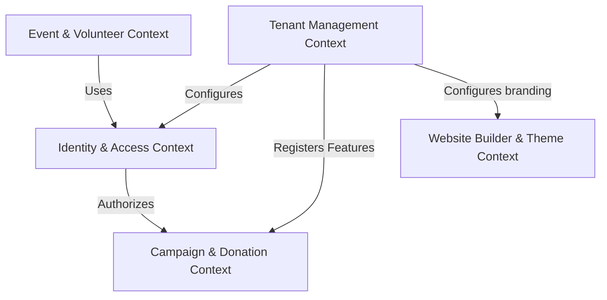
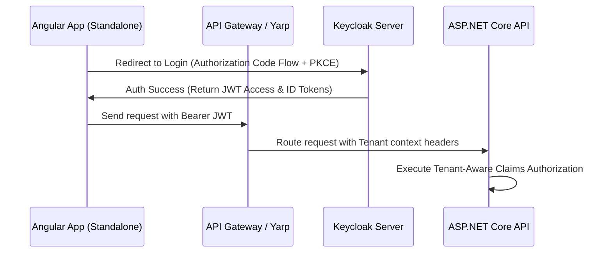
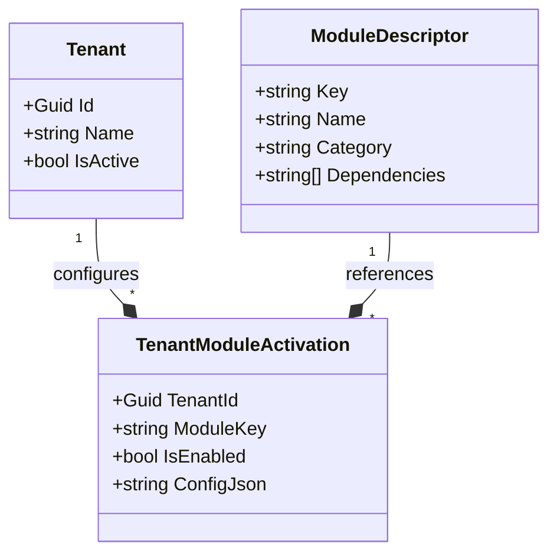
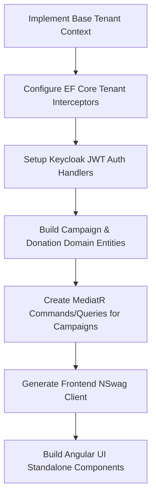

# InfiniteJourney - Enterprise Multi-Tenant SaaS Architecture Blueprint

This document defines the comprehensive, production-ready architectural design for **InfiniteJourney**—a highly scalable, multi-tenant digital experience and management platform for non-profits, Islamic organizations, charities, and community groups.

---

## User Review Required

> [!IMPORTANT]
> **Database Isolation Strategy**: We propose a **Hybrid Tenancy Model** (Option D) as the default. Standard tenants share a database with strict `TenantId` row-level isolation via EF Core Global Query Filters, while Enterprise/Premium tenants receive a dedicated database connection.
> Please review and confirm if this aligns with your budget and compliance requirements.

> [!WARNING]
> **Keycloak Realm Strategy**: We recommend a **Single Realm with Tenant Groups** for public users (donors, volunteers, members) to maintain a unified user base and low operational overhead, but a **Realm-per-Tenant** architecture for premium enterprise tenants who require custom SSO (SAML/OIDC identity provider federation).

---

## Open Questions

> [!NOTE]
> **Payment Gateways**: For the Donation module, do you plan to support centralized platform-level accounts (e.g., platform charging a platform fee and distributing payouts via Stripe Connect) or tenant-level payment gateway credentials? We have designed the domain to support both.

---

## Phase 1: Business Analysis

### 1.1 Business Goals
- **Empower Organizations**: Provide a zero-overhead digital operating system for small to large organizations.
- **Conversion Optimization**: Maximize donation conversions and member sign-ups via storytelling-focused user experiences.
- **Financial Transparency**: Provide real-time financial tracking, project updates, and impact metrics to build public trust.
- **Unified Upgrades**: Maintain a single codebase where enhancements are instantly deployable to all organizations.

### 1.2 User Personas
- **Platform Super Admin**: Manages SaaS operations, tenant provisioning, system health, and billing.
- **Tenant Owner / Admin**: Has complete authority over their tenant’s website, branding, activated modules, staff roles, and finances.
- **Volunteer Coordinator / Content Manager**: Tenant-level operational staff who manage volunteers, events, campaigns, and blogs.
- **Donor / Volunteer / Member**: End-users who interact with a tenant’s public portal, track contributions, or RSVP to events.
- **Public Guest**: General visitors browsing tenant landing pages or articles.

### 1.3 Tenant Types
- **Dawah & Islamic Centers**: Focus on prayer times, educational courses, memberships, and community events.
- **Charities & NGOs**: Focus on global relief projects, sponsorships, disaster response, and donor relations.
- **Local Volunteer / Community Groups**: Focus on local cleanups, social welfare, volunteer shifts, and news.

### 1.4 SaaS Monetization Models
1. **SaaS Subscription Tiers**:
   - *Basic*: Shared database, subdomain (`tenant.infinitejourney.com`), basic modules.
   - *Pro*: Custom domains, advanced theme customization, access to membership & course modules.
   - *Enterprise*: Dedicated database, custom Keycloak SSO federation, unlimited media storage.
2. **Transaction Fees**: A dynamic percentage cut (e.g., 0.5% - 2%) on donations processed through platform-managed payment flows.

---

## Phase 2: Multi-Tenancy Architecture

We evaluate four primary database tenancy designs below:

| Criteria | Option A: Shared DB + TenantId | Option B: Schema-per-Tenant | Option C: DB-per-Tenant | Option D: Hybrid Strategy (Recommended) |
| :--- | :--- | :--- | :--- | :--- |
| **Data Isolation** | Logical (Row level) | Schema logical | Physical isolation | Dynamic based on Subscription tier |
| **Cost Efficiency** | High (Low DB overhead) | Medium | Low (High server cost) | Optimal (Starter shared, Premium isolated) |
| **Complexity** | Low | Medium-High | High | Medium-High (Supported by EF Core) |
| **Backup & Restore**| Difficult per tenant | Moderate | Very Easy | Easy for premium, logical for standard |
| **Scalability** | Standard DB limits | Limit on schemas (PG) | Highly scalable | Excellent horizontal scaling |

### 2.1 Selected Approach: Option D (Hybrid Tenancy)
Standard tiers share a PostgreSQL database. EF Core enforces data isolation using **Global Query Filters** and a dynamic query interceptor:
```csharp
modelBuilder.Entity<BaseTenantEntity>()
    .HasQueryFilter(e => e.TenantId == _tenantContext.TenantId);
```
Enterprise tenants connect to their own physical PostgreSQL instances. The system resolves connection strings dynamically at runtime using a Redis-backed tenant registry lookup.

### 2.2 Technical Component Design
- **Tenant Resolution Middleware**:
  1. Inspects host header (e.g., `org1.infinitejourney.com` or `custom-domain.org`).
  2. Resolves tenant metadata (Tenant ID, Active status, Connection String, Theme, Active Features) from Redis cache; falls back to the database.
  3. Populates `TenantContext` scoped service.
- **Tenant Context (`ITenantContext`)**:
  ```csharp
  public interface ITenantContext
  {
      Guid TenantId { get; }
      string TenantName { get; }
      string ConnectionString { get; }
      bool IsFeatureEnabled(string featureName);
  }
  ```
- **Tenant Provisioning**:
  An integration pipeline triggered by Stripe checkout / Admin console:
  1. Creates tenant record in SaaS master database.
  2. Provisions custom Keycloak group / client mappings.
  3. Executes EF Core database migrations on the tenant's database schema.
  4. Seeds default administration roles and theme variables.

---

## Phase 3: Domain-Driven Design (DDD)



### 3.1 Bounded Context Definitions

#### 1. Tenant Management Context
- **Purpose**: SaaS administrative plane.
- **Aggregate Roots**: `Tenant`, `SubscriptionPlan`.
- **Entities**: `TenantDomain`, `BillingContact`.
- **Value Objects**: `DomainName`, `Subdomain`.
- **Domain Events**: `TenantProvisionedEvent`, `TenantSuspendedEvent`.

#### 2. Identity & Access Management (IAM) Context
- **Purpose**: User profiles, memberships, and role-based permissions.
- **Aggregate Roots**: `User`, `Role`.
- **Entities**: `Membership` (links User to Tenant with status), `Permission`.
- **Value Objects**: `EmailAddress`, `UserProfile`.
- **Domain Events**: `UserRegisteredEvent`, `MembershipAssignedEvent`.

#### 3. Campaign & Donation Context
- **Purpose**: Raising funds and transparent donor management.
- **Aggregate Roots**: `Campaign`, `Donation`.
- **Entities**: `RecurringPledge`, `DonorProfile`.
- **Value Objects**: `Money` (Amount, Currency), `TransactionReceipt`.
- **Domain Events**: `DonationReceivedEvent`, `CampaignGoalReachedEvent`.

#### 4. Event & Volunteer Context
- **Purpose**: Community mobilization, volunteering tracking.
- **Aggregate Roots**: `Event`, `VolunteerApplication`.
- **Entities**: `Shift`, `AttendanceLog`.
- **Value Objects**: `GeographicLocation`, `DateTimeRange`.
- **Domain Events**: `VolunteerShiftAssignedEvent`.

---

## Phase 4: Identity & Access Management (IAM)

We implement authentication and authorization using Keycloak.

### 4.1 Keycloak Realm Architecture
To support both low-cost standard tenants and high-security enterprise tenants:
1. **Shared Multi-Tenant Realm (`InfiniteJourney-Tenants`)**:
   Standard and Pro tenants share a single Keycloak realm.
   - Users have custom attributes containing their authorized `tenant_ids`.
   - Token payload includes:
     ```json
     {
       "sub": "user-uuid",
       "tenants": {
         "tenant-a-uuid": ["Organization Admin", "Volunteer Coordinator"],
         "tenant-b-uuid": ["Member"]
       }
     }
     ```
2. **Dedicated Realms**:
   Enterprise tenants receive their own Keycloak realm, enabling independent SAML/OIDC configuration.

### 4.2 Auth Flow Architecture



### 4.3 Database Schema (IAM Portion)
```sql
CREATE TABLE Users (
    Id UUID PRIMARY KEY,
    KeycloakUserId VARCHAR(255) UNIQUE NOT NULL,
    Email VARCHAR(255) NOT NULL,
    FirstName VARCHAR(100),
    LastName VARCHAR(100),
    CreatedAt TIMESTAMP WITH TIME ZONE NOT NULL
);

CREATE TABLE Memberships (
    Id UUID PRIMARY KEY,
    TenantId UUID NOT NULL,
    UserId UUID NOT NULL,
    RoleName VARCHAR(50) NOT NULL, -- e.g., "OrgAdmin", "Staff"
    Status VARCHAR(20) NOT NULL,    -- "Active", "Pending", "Suspended"
    JoinedAt TIMESTAMP WITH TIME ZONE NOT NULL,
    FOREIGN KEY (UserId) REFERENCES Users(Id)
);
CREATE UNIQUE INDEX idx_membership_tenant_user ON Memberships(TenantId, UserId);
```

---

## Phase 5: Core Domain Model

Entities are classified as follows:

| Classification | Entities |
| :--- | :--- |
| **Essential** | `Tenant`, `User`, `Membership`, `Campaign`, `Donation`, `ModuleActivation`, `Theme` |
| **Important** | `Event`, `VolunteerShift`, `Page`, `MediaFile`, `AuditLog`, `SystemConfig` |
| **Optional**  | `Course`, `Sponsorship`, `BeneficiaryCase`, `NewsletterSubscriber` |
| **Future**    | `AnalyticsReport`, `PlatformAuditorLog`, `PaymentTerminalIntegration` |

---

## Phase 6: Modular Feature System

Every tenant configuration details activated modules inside a centralized registry.



- **Feature Toggles**:
  The database maps feature statuses. Disabling a feature hides the UI block and blocks the API endpoints via an ASP.NET Core endpoint filter, preserving historical database tables.

---

## Phase 7: Dynamic Website Builder

Tenant portals are rendered dynamically using configurable blocks.

- **Entity Model (`Page`)**:
  ```json
  {
    "Id": "page-uuid",
    "TenantId": "tenant-uuid",
    "Slug": "about-us",
    "Title": "About Our Journey",
    "SeoSettings": {
      "MetaTitle": "About InfiniteJourney",
      "MetaDescription": "Empowering local communities with transparency.",
      "OpenGraphImage": "/media/og-about.jpg"
    },
    "Layout": [
      { "Type": "HeroSection", "Params": { "Title": "Hello!", "BgUrl": "/media/bg.jpg" } },
      { "Type": "DonationWidget", "Params": { "CampaignId": "campaign-uuid" } }
    ]
  }
  ```

---

## Phase 8: Theme Engine

We design a runtime theming system utilizing dynamic CSS variable injection.

### 8.1 Tailored Theme Configuration
```json
{
  "PrimaryColor": "#1E3A8A",
  "SecondaryColor": "#10B981",
  "AccentColor": "#F59E0B",
  "FontFamily": "Inter, sans-serif",
  "IsDarkMode": false
}
```

### 8.2 Runtime Style Injection (Angular)
On application bootstrap, the configurations are resolved from `TenantContext` and injected into the document root:
```typescript
document.documentElement.style.setProperty('--primary-color', theme.PrimaryColor);
document.documentElement.style.setProperty('--secondary-color', theme.SecondaryColor);
document.documentElement.style.setProperty('--font-family', theme.FontFamily);
```
Contrast metrics are computed at runtime using WCAG compliance helper methods to ensure text overlays automatically shift between light and dark modes based on background luminance values.

---

## Phase 9: Application Architecture

We implement a standardized, modular Clean Architecture directory structure.

```
InfiniteJourney.Backend/
├── Domain/                   # Domain Entities, Aggregate Roots, Domain Events, Value Objects
│   └── InfiniteJourney.Domain/
│       ├── Aggregates/
│       ├── Common/
│       └── Events/
├── Application/              # MediatR CQRS, Validators, Mappers, Interface abstractions
│   └── InfiniteJourney.Application/
│       ├── Campaigns/
│       ├── Common/
│       └── Interface/
├── Infrustructure/           # DB contexts, Keycloak Client, Cache Services, Payment Clients
│   └── InfiniteJourney.Infrustructure/
│       ├── Persistence/
│       └── Identity/
└── Web/                      # ASP.NET Core Controllers, Program.cs, Middleware
    └── InfiniteJourney.Web/
```

On the frontend, Angular uses standalone directory layers:
```
frontend/src/app/
├── core/                     # Authentication, Interceptors, Guards, Tenant-Context resolving
├── shared/                   # Generic UI buttons, grid layout wrappers, dynamic theme injection
└── features/                 # Dedicated module domains (donations, campaigns, website-builder)
```

---

## Phase 10: Database Design

### 10.1 Schema Structure
We create indexes with tenant qualifiers to guarantee data isolation speed.

```sql
CREATE TABLE Tenants (
    Id UUID PRIMARY KEY,
    Subdomain VARCHAR(100) UNIQUE NOT NULL,
    CustomDomain VARCHAR(255) UNIQUE,
    Status VARCHAR(25) NOT NULL,
    CreatedAt TIMESTAMP WITH TIME ZONE NOT NULL
);

CREATE TABLE Campaigns (
    Id UUID PRIMARY KEY,
    TenantId UUID NOT NULL,
    Title VARCHAR(255) NOT NULL,
    TargetAmount DECIMAL(18,2) NOT NULL,
    RaisedAmount DECIMAL(18,2) DEFAULT 0.00,
    Status VARCHAR(25) NOT NULL,
    FOREIGN KEY (TenantId) REFERENCES Tenants(Id)
);
CREATE INDEX idx_campaigns_tenant_lookup ON Campaigns(TenantId);

CREATE TABLE Donations (
    Id UUID PRIMARY KEY,
    TenantId UUID NOT NULL,
    CampaignId UUID NOT NULL,
    Amount DECIMAL(18,2) NOT NULL,
    DonorEmail VARCHAR(255) NOT NULL,
    ProcessedAt TIMESTAMP WITH TIME ZONE NOT NULL,
    FOREIGN KEY (TenantId) REFERENCES Tenants(Id),
    FOREIGN KEY (CampaignId) REFERENCES Campaigns(Id)
);
CREATE INDEX idx_donations_tenant_campaign ON Donations(TenantId, CampaignId);
```

---

## Phase 11: API Strategy

### 11.1 OpenAPI and Client Generation
- **NSwag Integration**:
  The backend hosts an OpenAPI specification via NSwag. A client generation build script automatically updates the Angular services:
  ```powershell
  npx nswag run /config:nswag.json
  ```
  This creates TypeScript API service proxies automatically, ensuring zero manual writing of HTTP requests in Angular.

---

## Phase 12: Security

- **Isolation Validation Interceptor**:
  EF Core features a global saving interceptor ensuring that no entities are committed to the database with a mismatched tenant identifier:
  ```csharp
  public override ValueTask<InterceptionResult<int>> SavingChangesAsync(
      DbContextEventData eventData, InterceptionResult<int> result, CancellationToken cancellationToken = default)
  {
      foreach (var entry in eventData.Context.ChangeTracker.Entries<BaseTenantEntity>())
      {
          if (entry.State == EntityState.Added)
              entry.Entity.TenantId = _tenantContext.TenantId;
          else if (entry.Entity.TenantId != _tenantContext.TenantId)
              throw new TenantViolationException("Cross-tenant database modification detected.");
      }
      return base.SavingChangesAsync(eventData, result, cancellationToken);
  }
  ```
- **OWASP Safeguards**:
  Strict CORS setups, security headers (CSP, X-Frame-Options), dynamic rate limiting via IP and Tenant scopes, and anti-CSRF token verification on POST/PUT requests.

---

## Phase 13: Deployment

### 13.1 Docker Compose Architecture
```yaml
version: '3.8'
services:
  postgres:
    image: postgres:15-alpine
    environment:
      POSTGRES_DB: infinite_journey_saas
      POSTGRES_PASSWORD: System@1122
    ports:
      - "5432:5432"
  redis:
    image: redis:7-alpine
    ports:
      - "6379:6379"
  keycloak:
    image: quay.io/keycloak/keycloak:latest
    command: start-dev
    environment:
      KEYCLOAK_ADMIN: admin
      KEYCLOAK_ADMIN_PASSWORD: admin
    ports:
      - "8080:8080"
  backend-api:
    build:
      context: ./InfiniteJourney.Backend
      dockerfile: Web/InfiniteJourney.Web/Dockerfile
    ports:
      - "5000:8080"
    depends_on:
      - postgres
      - redis
      - keycloak
```

---

## Phase 14: Phase 1 Implementation Plan

We target the **Campaign** and **Donation** features as our reference business module.

### 14.1 Justification for Choice
Campaigns and Donations test:
- Database row-level isolation logic.
- Transaction validation rules.
- Real-time financial calculations (e.g. updating campaign raised totals using Domain Events).
- Integration with external payment flows and audit tracking.

### 14.2 Technical Execution Tasklist


---

## Verification Plan

### Automated Tests
- **Backend Unit Tests**: Verify `TenantContext` injection and EF Core query filtering logic.
  ```powershell
  dotnet test InfiniteJourney.Backend/Tests/InfiniteJourney.Tests
  ```
- **Security Audit Tests**: Attempt cross-tenant queries programmatically and verify that `TenantViolationException` is thrown.

### Manual Verification
- Deploy using the Docker Compose setup.
- Log in to Keycloak, configure two test tenants, and access URLs via local hostnames (e.g. `tenant1.localhost:5000` and `tenant2.localhost:5000`). Confirm that database entities created in `tenant1` never appear in `tenant2`.
